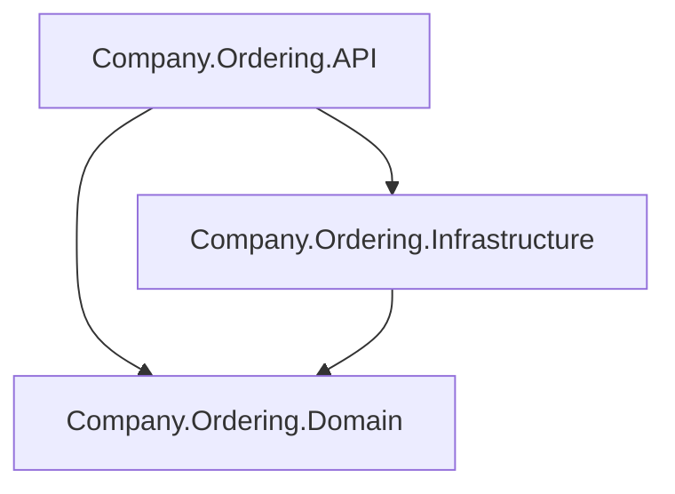

# Company.Ordering

## Architectural Decisions

### Programming Language & Framework

.NET 9 (C#) with ASP.NET Core Web API project by requirements.
- With OpenAPI/Swagger for API documentation as per requirements.
- Used Controllers instead of minimal APIs for better structure and separation of concerns due to required DDD patern.
- Enlisted in .NET Aspire orchestration for better monitoring and observability.

### Domain Driven Design
To follow DDD implemented following solution structure:
- **Aplication Layer (`Company.Ordering.API`)**: Exposes HTTP endpoints, handles requests via controllers, and uses MediatR for command/query dispatching.
- **Domain Layer (`Company.Ordering.Domain`)**: Contains core business logic, entities, and validation (e.g., `Order`, `OrderValidator`).
- **Infrastructure Layer (`Company.Ordering.Infrastructure`)**: Implements data access using Entity Framework Core and repository patterns.

### Database
Used localdb as simplest from the allowed options.
Using default ORM (Entity Framework) Code-First approach allows for fast switching to another DB if necessary.

### Validation
Used FluentValidation as required.
As a bonus it allows to use Async validation for checking product stock.
Downside is that it can't be used for some layers, for example to detalize database model with Code-First approach. For exaample by specifying length, precision of the apropriate fields.

### Logging
Used Serilog as required.
Default Aspire related setup such as OpenTelemetry been added as well, to provide better observability.

### Testing
All tests where implemented using xUnit as required (and commonly recommended atm).

#### Manual
Can be done using:
- *.http files via Visual Studio.
- Swagger

or any other tool.

#### Unit Testing
**Application Layer** `Company.Ordering.API.Tests` created using xUnit (as required) mocking dependcies using Moq.

**Domain Layer** `Company.Ordering.Domain.Tests` at the moment do not contain any logic, just interfaces.
No tests had been created for it.

**Infrastructure layer** tests `Company.Ordering.Infrastructure.Tests` implemneted with slightly bigger scope .
[Microsoft recomends implementing Unit-Tests my mocking Repositories, instead of mocking DbContext](https://learn.microsoft.com/en-us/ef/core/testing/testing-without-the-database).
But the only logic present in this project is implementation of repositories using Entity Framework.
EF DbContext allows to do the same thing in different ways:
- adding a new entity can be done via DbContext or DbSet
- quering single Order can be done using `SingleOrDefaultAsync` with predicate or `FindAsync` with primary key.

So it's not very feasible to test all the possible ways of doing the same thing.
Using real DbContext with some in-memory database simplifies test implementation, while preserves test independence and performance.
In-memory might seem simple option to choose, but it wouldn't support generation of Order Id inside database during Order Creation.
Microsoft recommends to use InMemory SQLite as well.

#### Integration Testing
Implemented in `Company.Ordering.API.IntegrationTests` using [Microsoft recommendation](https://learn.microsoft.com/en-us/aspnet/core/test/integration-tests?view=aspnetcore-9.0). 
They test 2 required endpoints with all explicitly mentioned cases using real database.
Database for Integration Testing can be customized using environment specific configuration file, for example `appsettings.IntegrationTest.json`.
In order for it work correct [ASP.NET environment](https://learn.microsoft.com/en-us/aspnet/core/fundamentals/environments?view=aspnetcore-9.0) must be specified.
Please note, that Database being recreated at the begining of each test run. This way it's possible to check DB state after test run.
